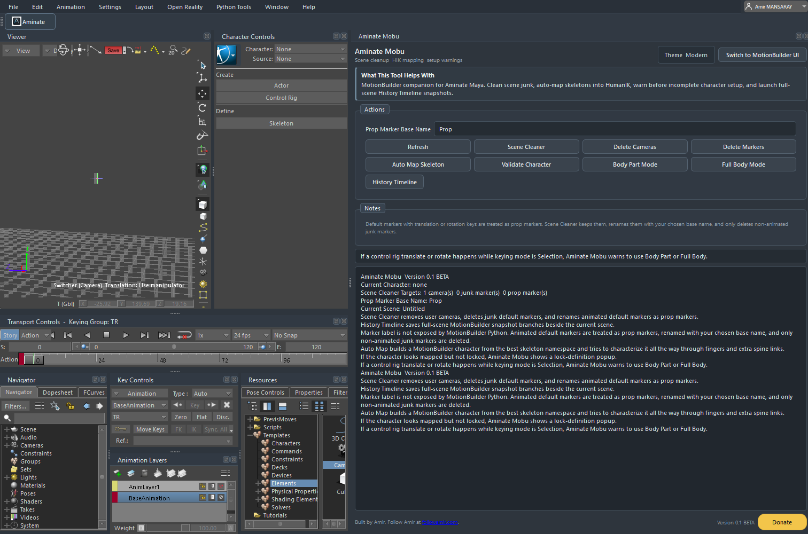
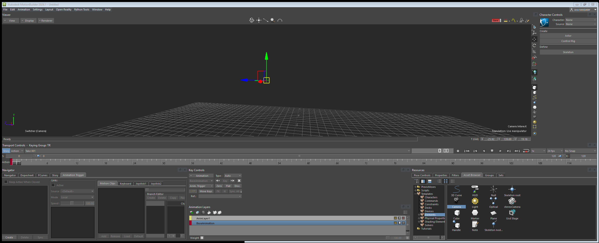
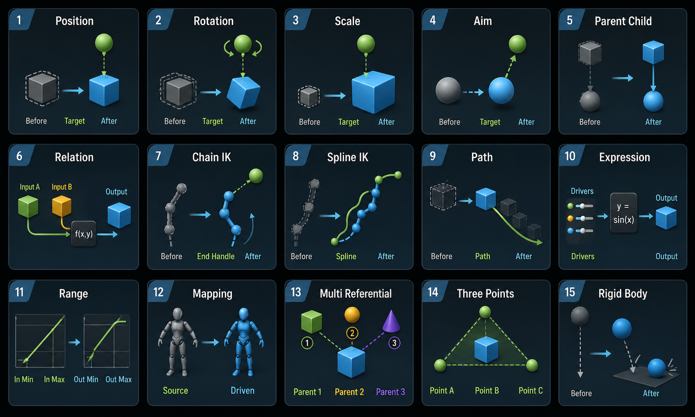

# Aminate Motion Builder

Aminate Motion Builder is a MotionBuilder helper for cleaning mocap scenes, preparing HumanIK character definitions, building frame-zero T-poses, managing constraints, and making common MotionBuilder workflows easier to understand.

This is the public beta repository for **Aminate Motion Builder 0.1 Beta**.

## Install

1. Download the latest release zip: `Aminate_Mobu_v0.1_BETA.zip`.
2. Unzip it.
3. Drag `Install_Aminate_Mobu.py` into the MotionBuilder viewport.
4. Aminate installs its startup hook, opens the Aminate panel, and loads automatically on future MotionBuilder launches.

Manual fallback:

1. Open MotionBuilder's Python Editor.
2. Run `aminate_mobu_package/install_motionbuilder_startup.py`.
3. Run `aminate_mobu_package/launch_aminate_mobu.py`.

## Feature Videos

### Premiere: 40 Seconds To Mocap

<video src="https://github.com/AmirMDEV/Aminate/releases/download/v0.1-beta/40_Seconds_to_Mocap.mp4" controls muted playsinline width="100%"></video>

[Open the premiere video](https://github.com/AmirMDEV/Aminate/releases/download/v0.1-beta/40_Seconds_to_Mocap.mp4)

### Auto Map Skeleton And T-Pose Frame 0

<video src="https://github.com/AmirMDEV/Aminate/releases/download/v0.1-beta/Mobu_Automap_and_Tpose.mp4" controls muted playsinline width="100%"></video>

[Open the Auto Map and T-Pose video](https://github.com/AmirMDEV/Aminate/releases/download/v0.1-beta/Mobu_Automap_and_Tpose.mp4)

### Scene Cleaner

<video src="https://github.com/AmirMDEV/Aminate/releases/download/v0.1-beta/Mobu_Scene_Cleaner.mp4" controls muted playsinline width="100%"></video>

[Open the Scene Cleaner video](https://github.com/AmirMDEV/Aminate/releases/download/v0.1-beta/Mobu_Scene_Cleaner.mp4)

## Screenshots

## Main Features

### Scene Cleaner

Scene Cleaner removes common import clutter so a MotionBuilder scene is easier to work with before characterization or retargeting.

It can:

- delete user cameras created during imports;
- remove unused unlabeled markers;
- preserve markers that appear to carry useful animated prop motion;
- rename preserved prop markers with clear names;
- keep cleanup actions inside one visible panel.

### Auto Map Skeleton

Auto Map Skeleton is designed for scenes with one or more humanoid skeletons.

It can:

- read the selected skeleton, selected bone, or selected skinned mesh;
- infer the correct hierarchy from that selection;
- create numbered character definitions such as `animate_auto_1`, `animate_auto_2`, and `animate_auto_3`;
- map common hips, spine, neck, head, arm, hand, leg, foot, toe, finger, twist, and roll-bone naming patterns;
- reduce the extra manual setup usually needed before using MotionBuilder Character Controls.

### T-Pose Frame 0

T-Pose Frame 0 prepares a character for cleaner MotionBuilder definition and retargeting.

It can:

- place the selected character into a T-pose on frame 0;
- key the result on frame 0 only;
- keep the character upright instead of leaning forward;
- help source and target characters match before using one as the other's source.

### Definition Manager

Definition Manager keeps reusable skeleton definitions inside Aminate.

It can:

- save a working skeleton definition;
- load a saved definition quickly;
- rename definitions;
- remove old definitions;
- reduce repeated setup when working with similar rigs.

### Constraints Manager

Constraints Manager gives a clearer interface for MotionBuilder constraint workflows.

It focuses on useful MotionBuilder constraint types such as:

- Parent/Child;
- Position;
- Rotation;
- Scale;
- Aim;
- Three Points;
- Mapping;
- Multi-Referential;
- Range;
- Chain IK;
- Spline IK;
- Expression;
- Path;
- Rigid Body;
- Relation-style workflows.

It can:

- list useful constraints without showing unrelated character solver objects;
- give short visual explanations for what each constraint is for;
- rename constraints into easier names;
- key constraint settings and selected properties;
- open bake/plot workflows for saving results back to a skeleton or control rig.

### Modern UI

Aminate can switch into a modern MotionBuilder-style UI.

It can:

- open the Aminate panel on startup;
- switch to the Modern UI by default after installation;
- restyle Aminate-owned controls;
- modernize themeable MotionBuilder chrome where the plugin layer can safely do so;
- return to the default MotionBuilder UI path when requested.

### Rich Tooltips

Aminate adds clearer tooltip explanations for buttons and icon-only tools.

The tooltip pass is intended to explain the action in plain language rather than only repeating the button label.

### History Timeline

History Timeline gives MotionBuilder a safer snapshot workflow.

It can:

- save full-scene snapshots beside the current writable scene;
- restore earlier snapshots;
- mark important milestones;
- branch from an older state;
- cap snapshot counts;
- run Auto History for ongoing protection.

## Compatibility

- Autodesk MotionBuilder with Python support.
- Tested primarily against MotionBuilder 2026.
- Qt support prefers `PySide6` and falls back to `PySide2`.
- Startup install targets detected MotionBuilder version folders under `Documents\MB`.

## License

Aminate is proprietary source-available software.

You may use and redistribute unmodified copies under the included license. You may not fork, modify, rebrand, publish modified copies, or create derivative versions without written permission from Amir Mansaray.

See [LICENSE](LICENSE).

## Credit

Built by Amir Mansaray.

- Follow Amir: <https://followamir.com>
- Donate: <https://www.paypal.com/donate/?hosted_button_id=2U2GXSKFJKJCA>
